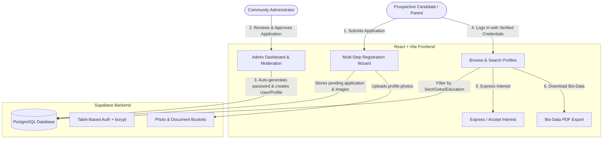
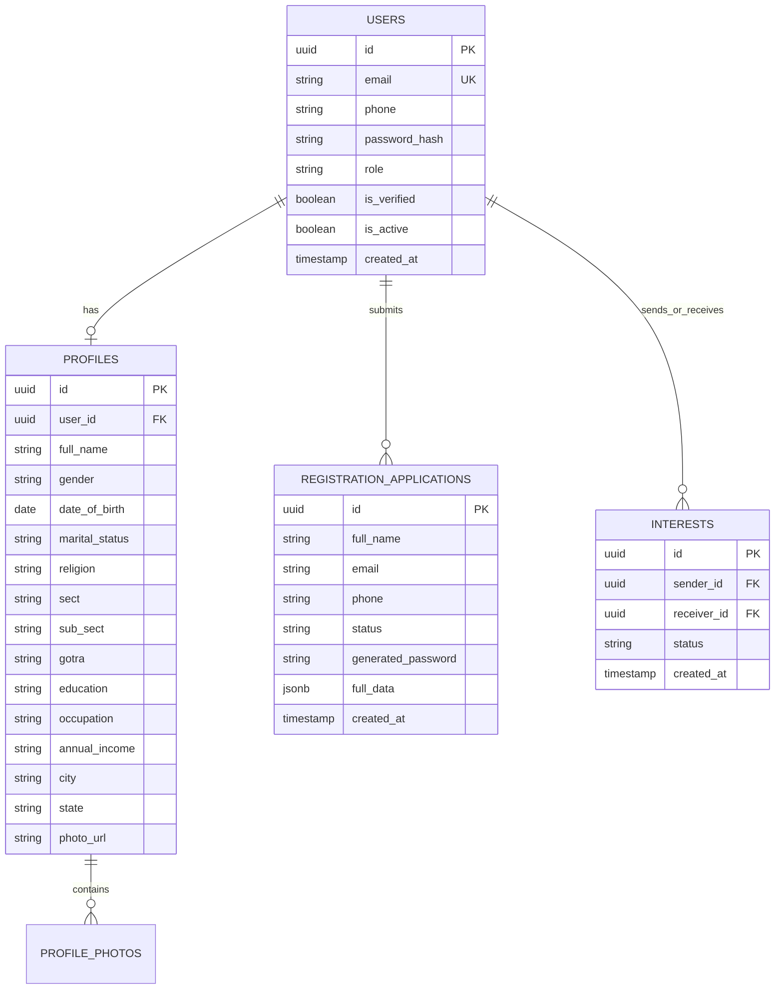

# 💍 Jain Matrimony - Community Matchmaking Platform

[](https://react.dev/)
[](https://vitejs.dev/)
[](https://tailwindcss.com/)
[](https://supabase.com/)
[](LICENSE)

A modern, full-stack community matrimonial matchmaking web application specifically designed for the **Jain Community** (Digambar, Shwetambar, Murtipujak, Sthanakvasi, Terapanthi, and related traditions). 

Built with **React 19**, **Vite**, **Tailwind CSS**, and **Supabase (PostgreSQL & Storage)**, featuring a multi-step registration workflow, administrative verification & password provisioning, advanced matchmaking filters, bio-data PDF export, and interest management.

---

## 🌟 Core Concept & Problem Solved

Traditional matrimony portals often lack cultural nuance, charging exorbitant subscriptions while failing to cater to community-specific criteria (sub-sects, gotras, dietary principles, horoscope matching). 

**Jain Matrimony** provides a dedicated, trusted, and verified matrimonial platform that preserves cultural values while delivering a sleek, modern user experience:
1. **Curated & Verified Profiles**: New members submit applications with identity and photo verification reviewed by community admins before profile activation.
2. **Community-Specific Preferences**: Filters for Sect (Digambar / Shwetambar), Sub-sect, Gotra, Dietary habits (Pure Jain Vegetarian / Chovihar), Horoscope/Manglik status, and Career background.
3. **Privacy & Security**: Passwords are cryptographically hashed with `bcryptjs`. Sensitive contact information is protected until interests are mutual.
4. **Automated Bio-data PDF**: Download standardized, professionally formatted Jain bio-data PDF cards in one click.

---

## 🏗️ System Architecture & Workflow



---

## ✨ Key Features

### 👤 User Features
- **Multi-Step Registration**: Smooth, structured form covering:
  - Personal Information (Name, Date of Birth, Height, Marital Status)
  - Religious Details (Sect, Sub-sect, Sampradaya, Gotra, Maternal Gotra)
  - Astro & Horoscope (Manglik status, Rashi, Nakshatra, Birth Time & Place)
  - Education & Occupation (Highest degree, College, Designation, Annual Income)
  - Family Details (Father's & Mother's occupation, Siblings, Native Place)
  - Lifestyle & Habits (Dietary habits, Hobbies, Values)
  - Photo Gallery Upload
- **Advanced Matchmaking Filters**: Filter candidates by age, height, sub-sect, marital status, education level, city/state, and income brackets.
- **Interactive Profile Details**: Detailed bio-data views with photo carousels and family information.
- **Interest Exchange System**: Send connection requests, manage incoming requests, and view mutual connections.
- **One-Click Bio-Data Download**: Client-side PDF bio-data generator powered by `html2canvas` and `jspdf`.
- **Success Stories**: Public gallery of successfully married couples who connected through the platform.

### 🛡️ Admin & Moderation Panel
- **Application Review Queue**: Real-time moderation pipeline to inspect submitted details and uploaded photos.
- **Automated Password Generator**: Generates strong 12-character passwords upon profile verification.
- **User Management**: Activate, deactivate, or edit candidate profiles.
- **Success Story Editor**: Add and manage verified marriage stories and testimonials.

---

## 🛠️ Tech Stack

| Domain | Technology | Purpose |
| :--- | :--- | :--- |
| **Frontend Framework** | [React 19](https://react.dev/) | High-performance component-driven UI |
| **Build Tool** | [Vite 5](https://vitejs.dev/) | Lightning-fast HMR and bundle compilation |
| **Styling** | [Tailwind CSS 3](https://tailwindcss.com/) | Utility-first responsive design system |
| **Icons** | [Lucide React](https://lucide.dev/) | Clean, modern UI icon set |
| **Routing** | [React Router 7](https://reactrouter.com/) | Client-side dynamic routing & route guards |
| **Database & Storage** | [Supabase](https://supabase.com/) | PostgreSQL database, Storage buckets, and Realtime |
| **Security & Auth** | [bcryptjs](https://github.com/dcodeIO/bcrypt.js) | Password hashing (10 salt rounds) for table-based auth |
| **PDF Engine** | [jspdf](https://github.com/parallax/jsPDF) & [html2canvas](https://html2canvas.hertzen.com/) | Client-side dynamic matrimonial bio-data rendering |

---

## 🗄️ Database Schema & Entities

The database runs on Supabase (PostgreSQL). Key tables defined in `supabase-setup.sql`:



---

## 📁 Repository Structure

```
jain_matrimony/
├── .env.example                # Supabase environment variables template
├── .gitignore                  # Git ignore rules for node_modules, build, .env
├── index.html                  # Main HTML entry point
├── package.json                # Project dependencies and npm scripts
├── postcss.config.js           # PostCSS configuration
├── tailwind.config.js          # Tailwind CSS styling configuration
├── vite.config.js              # Vite bundler configuration
├── supabase-setup.sql          # Full PostgreSQL database schema & tables
├── supabase_migrations/        # Modular SQL migration scripts
└── src/
    ├── App.jsx                 # Application entry with routing provider
    ├── main.jsx                # React DOM mount point
    ├── index.css               # Global styling & Tailwind directives
    ├── components/             # Reusable UI components (Navbar, FilterBar, Modals, Cards)
    ├── data/                   # Initial seeds & dummy fallback data
    ├── lib/
    │   └── supabase.js         # Supabase client initializer & connection test
    ├── pages/                  # Main user views (Home, Browse, Login, Register, MyProfile, etc.)
    │   └── admin/              # Admin views (Dashboard, Pending Applications, All Profiles, etc.)
    ├── routes/
    │   └── AppRoutes.jsx       # Route mappings & Protected Routes
    └── services/               # API service layer (authService, profileService, adminService, etc.)
```

---

## 🚀 Getting Started

### Prerequisites

- **Node.js**: v18.0.0 or higher
- **npm** or **yarn** / **pnpm**
- A free **[Supabase](https://supabase.com/)** account

---

### 1. Clone the Repository

```bash
git clone https://github.com/himanshu-0807/jain_matrimony.git
cd jain_matrimony
```

### 2. Install Dependencies

```bash
npm install
```

### 3. Setup Supabase Database

1. Log into your **Supabase Dashboard** and create a new project.
2. Navigate to the **SQL Editor** tab.
3. Open `supabase-setup.sql` from this repository, paste the contents into the SQL Editor, and click **Run**.
4. In the **Storage** section, create a public bucket named `profile-photos` and `application-documents`.

### 4. Configure Environment Variables

Copy the sample environment file:

```bash
cp .env.example .env
```

Open `.env` and fill in your Supabase credentials from **Project Settings > API**:

```env
VITE_SUPABASE_URL=https://your-project-id.supabase.co
VITE_SUPABASE_ANON_KEY=your-anon-public-key-here
```

### 5. Create Default Admin Account

Run the following SQL snippet in the Supabase SQL Editor to provision an initial administrator:

```sql
INSERT INTO users (email, phone, password_hash, role, is_verified, is_active)
VALUES (
    'admin@matri.com',
    '9999999999',
    '$2a$10$N9qo8uLOickgx2ZMRZoMyeIjZAgcfl7p92ldGxad68LJZdL17lhWy',  -- Password: 123456 (change upon initial login)
    'admin',
    true,
    true
);
```

### 6. Run the Development Server

```bash
npm run dev
```

Open your browser and navigate to `http://localhost:5173`.

---

## 📦 Production Build

To build the optimized static assets for production:

```bash
npm run build
```

The output will be generated in the `dist/` directory, ready to deploy to **Vercel**, **Netlify**, **Cloudflare Pages**, or **Firebase Hosting**.

---

## 📄 License

This project is licensed under the [MIT License](LICENSE).
